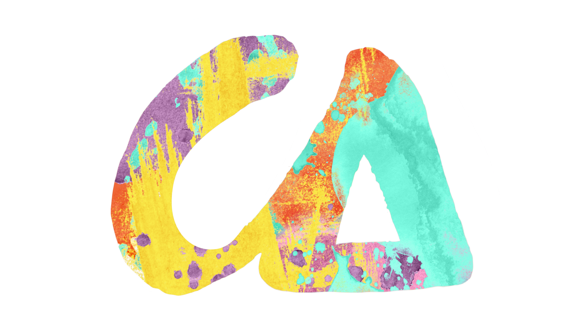
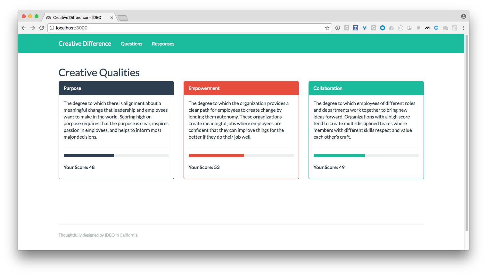
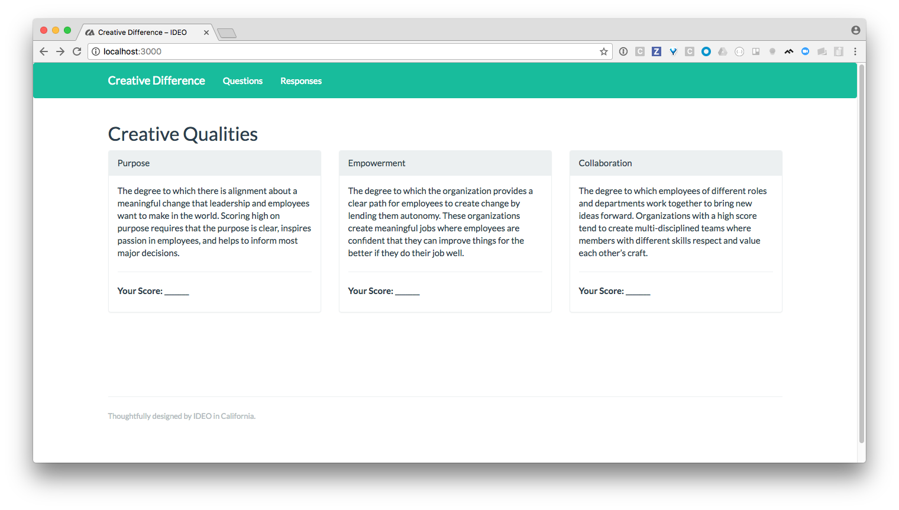
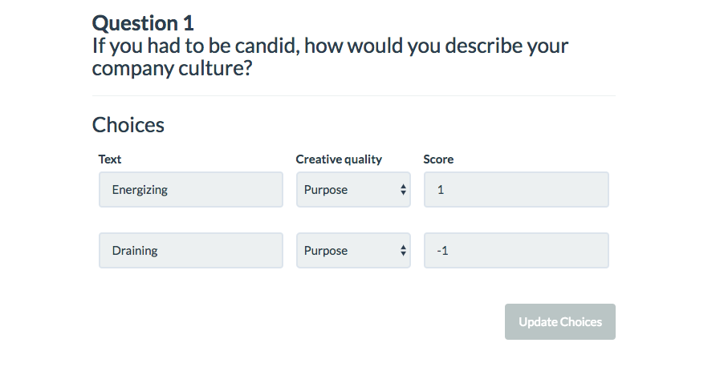
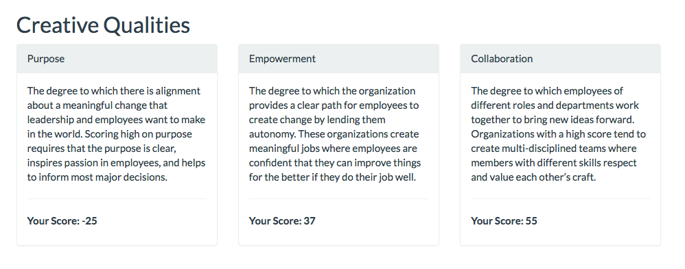
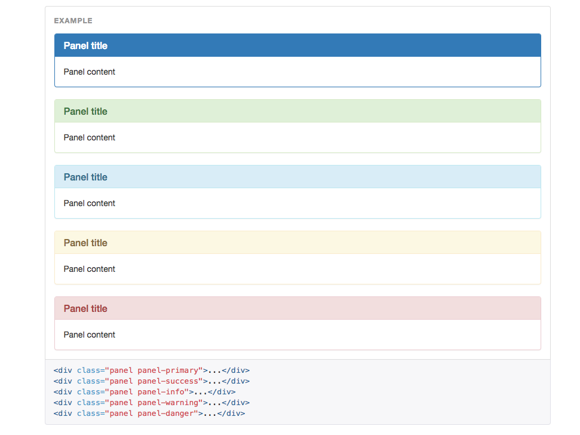

# IDEO Creative Difference Rails Challenge

Hello! Welcome to the [IDEO Creative Difference](https://creativedifference.ideo.com) Rails challenge.

This challenge will test your ability to write clean, intuitive, and well-tested Rails code – all things we care about deeply at IDEO!

Please set aside **two hours** to complete this exercise. If it's taking you longer, feel free to stop and [head down to the reflection in Part 3](#Part 3: Reflection and Submission). Good luck!

## Introduction

This challenge contains an example Rails app with some pre-existing code and tests.



Your task will be to take the app in this repo and add new behavior to it! ([Jump to the challenge](#the-challenge))


## Environment Setup

Start by cloning this repository:

```bash
$ git clone git@github.com:ideo/c-delta-challenge.git
```

Next, install the project's dependencies using Bundler (run `gem install bundler` if you don't have it)

```bash
$ cd c-delta-challenge
$ bundle install
```

Confirm that Rails works!

```bash
$ rails --version
Rails 5.0.1
```

Now set up your database:

```bash
$ rails db:migrate
$ rails db:seed
$ rails db:test:prepare
```

We've included a test suite written using [RSpec](http://rspec.info/). Run it and ensure that all tests pass!

```bash
$ rspec spec/

...


Finished in 0.43062 seconds (files took 1.29 seconds to load)
22 examples, 0 failures
```

Finally, run the Rails server and load the page at `http://localhost:3000`

```bash
$ rails s
=> Booting Puma
=> Rails 5.0.1 application starting in development on http://localhost:3000

...
```

​:tada: :clap: :tada:

You're ready to start!


## A Quick Walkthrough

Our demo app is a (very!) pared down version of our [Creative Difference](http://creativedifference.ideo.com) product, which helps organizations assess the different qualities that help make companies creatively competitive. We achieve this by surveying hundreds (or thousands) of employees across the organization and scoring their different creative qualities based on a rubric.

Based on the survey responses, the company gets a score for each Creative Quality which we help them analyze and improve on.

If you run the server, the home page shows a very basic dashboard with three creative qualities: **Purpose**, **Empowerment**, and **Collaboration**.



If you head over to the **Questions** tab, you can see the questions that make up this sample survey.


Drilling down into a question lets you see the different answer choices and how each choice impacts the score of the Creative Quality it corresponds to:


In this example, an answer of "Energizing" gives a 1 score for the **Purpose** creative quality. We have simplified the implementation in this challenge app, but in our production app, some questions have choices that impact more than one quality.

Our seeds file also creates 100 survey responses. Click the **Responses** tab to see all of them.


A response is "completed" if all of the 10 questions have been answered.

Drilling down into a response lets you see how the respondent answered each question (their answer is in **bold**):


That's the tour! Let's start the challenge.

# The Challenge

## Part 1: Scoring Responses

When viewing a question, you'll notice that each choice affects a particular Creative Quality either positively or negatively.



This means that if a respondent chooses "Draining," the score for "Purpose" is decreased by 1.

### 1.1: Scoring Creative Qualities for a single response to a question

Update the `response#show` page to show how each question response impacts Creative Quality scores, as follows:


If a score is impacted positively, color it in green. If it's impacted negatively, color it red (you can use [Bootstrap](http://getbootstrap.com/docs/3.3/) for this).

When you're done, write a commit. If your code changes the behavior of any models, make sure that behavior is tested!

### 1.2: Scoring Creative Qualities for an entire response

Next, we're diving into some complexity. We'd like to display the Creative Quality score for the entire response and display it at the top of the page:


We score each Creative Quality by adding up the raw score for all of the responses where someone chose a choice associated with that creative quality, and divide that by the maximum possible positive score for that quality.

In more detail:

- The **raw score** is the sum of all of the scores chosen for that creative quality.
  - **Example:** If I selected four question choices that impacted the **Purpose** quality with 3, 3, 2, and -1, then my raw score would be  `3 + 3 + 2 - 1 = 7`.
- The **max score** is the highest possible score a respondent could've gotten _(ie: if you answered by choosing the highest value choice for each question)_. It is dynamic, because if you skip a question, we don't increase the max.
  - **Example:** If you selected 6 question choices that are linked to **Purpose**, and each one had a question choice with a score of 2, then the max would be `10 * 6 = 60`

Write another commit when you're done (and yep –– test any behavior changes to models!).

### 1.3 Scoring Creative Qualities globally

At this point you've completed scoring for individual question responses as well as for entire response sets.

Now let's show our global scores on the front page!



Global scoring is relatively simple:

- The **normalized score** (ie: **Collaboration: 73**) is the final score that we display per quality, and should be between -100 and 100.
  - Step 1: Add up the raw and max scores for this quality across all responses.
  - Step 2: Divide the raw by the max and multiply it by 100 (_we also floor the value if > 100 or ceil if < -100_).
  - (The formula is: `(total_raw_for_quality / total_max_for_quality) * 100`)
  - **Example:** If across all responses, the total raw score for Collaboration is 240 and the max is 575, then the normalized score would be `(240 / 575) * 100 = 42`). Ceil or floor the value if it ends up outside the -100 to 100 bounds.

- For each Creative Quality, show the normalized score rounded to the nearest integer.

- Above each score, add a little "progress bar" to visualize the score (there's an existing [Bootswatch component](https://bootswatch.com/flatly/) for doing this). Fill the progress bar with that Creative Quality's color.

You're all done! Make a final commit of your work!

## Part 2: Displaying the Results

The home page lists three of the six Creative Qualities we see as essential to innovation within an organization.


In order to make each Creative Quality more memorable, we'd like to associate each quality to a color. We're already using [Twitter Bootstrap](http://getbootstrap.com/) and the [Flatly Bootswatch Theme](https://bootswatch.com/flatly/), so let's have the colors correlate to one of the five colors listed in the **Container > Panels** section (`primary`, `danger`, `success`, `info`, and `warning`)



Your job will be to implement the following:

- Assign each Creative Quality to one of the five Bootstrap colors.
- Whenever a new Creative Quality is created, it should automatically be assigned a color at random.
- Make it so that no two Creative Qualities can be assigned to the same color (let's assume for now that we won't have more than five qualities)
- The panels on the home page should make use of the colors (**see screenshot below**; refer to the [Bootswatch documentation](https://bootswatch.com/flatly/))


When you're done, write a commit. And bonus points if you can add an integration test to ensure end-to-end coverage.

## Part 3: Reflection and Submission

That's a wrap!

To submit your challenge, please **send us an email at c-delta-challenge@ideo.com** with the following:

### Reflection

Tell us what you thought of this coding challenge. What did you like? What did you not like?

### Code Improvements

If you had more time, are there any pieces of code (ours or yours) that you'd improve? How so and why?

### A link to your code!

Create a Github repo and send us the link!

**Please do not fork this repo, as it will be publicly viewable for all other candidates.**


## Thanks!

Hope you enjoyed this challenge – we really appreciate you making the time!

– The IDEO Products Team
